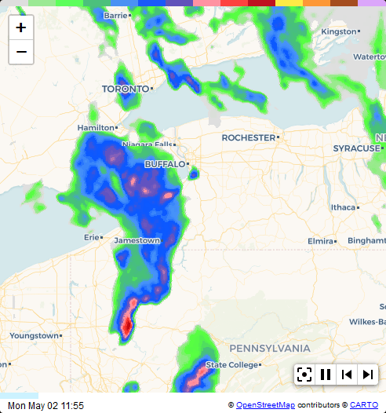

# Weather Radar Card

A Home Assistant rain radar card using tiled radar imagery from RainViewer, NOAA/NWS, and DWD (Deutscher Wetterdienst).

[](https://github.com/hacs/integration)
[![GitHub Release][releases-shield]][releases]
[![License][license-shield]](LICENSE)


## Description

This card displays animated weather radar loops within Home Assistant. It supports multiple radar data sources and map styles, and can be zoomed and panned seamlessly.



## What's New

The 3.x series is a complete rewrite of the card. Version 3.0 swapped the iframe for a native LitElement and rebuilt the radar engine; version 3.1 then overhauled the marker system. If you're upgrading from 2.x, both apply — read both sections.

### Version 3.1 — Multi-marker overhaul

The single-marker config is replaced by a `markers[]` array. Each marker is a static lat/lon or an `entity` (`device_tracker.*`, `person.*`, `zone.*`, or anything with `latitude`/`longitude` attributes). Positions update live on every Home Assistant state change.

**Auto-migration:** Existing 2.x / 3.0 configs continue to work — the card converts the old single-marker fields to a `markers[]` entry in memory on load and logs a deprecation warning. No YAML changes required to upgrade. (See [Migration from single-marker config](#migration-from-single-marker-config).)

Highlights:

- **Default home marker** — when `markers` is absent, the card auto-creates a `zone.home` marker. `markers: []` opts out.
- **Map tracking** — set `track: entity` or `track: true` per marker. Priority: a `person.*` matching the logged-in HA user → any other entity → `track: true`.
- **Clustering** (`cluster_markers`, on by default) — nearby markers collapse into a count badge; tap to spiderfy. Home clusters render as the home icon with a small superscript count.
- **Icon overhaul** — any `mdi:*` icon works. The editor uses HA's icon picker with autocomplete and live preview. Picking an entity auto-fills the icon from `attributes.icon`, `device_class`, `source_type`, or a domain default.
- **Per-marker `color`** for default and MDI icons.
- **`mobile_only: true`** flag replaces the old `mobile_marker_*` fields.
- **Theme-aware footer** — the footer / progress-bar chrome follows HA's theme (or OS dark mode), independent of map style.
- **NOAA / NWS colour bar** — the NWS reflectivity scale is shown when `data_source: NOAA`.

### Version 3.0 — Complete rewrite

#### No more iframe

Previous versions rendered the map inside a hidden `<iframe>` to work around Leaflet's incompatibility with Home Assistant's Shadow DOM. Version 3.0 is a native LitElement web component — the map lives directly in the card's Shadow DOM alongside the rest of your dashboard. This means:

- Proper integration with HA theming and layout
- No opaque origin / referrer header workarounds
- Faster initial render and lower memory overhead
- Full browser DevTools visibility into card state

#### Leaflet is now bundled

Leaflet is imported as an npm module and compiled into `weather-radar-card.js`. You no longer need to manually copy `leaflet.js`, `leaflet.css`, `leaflet.toolbar.min.js`, or `leaflet.toolbar.min.css` into your `www` folder. **If upgrading from v2, delete those files** — they are unused and waste space.

The only files still distributed alongside `weather-radar-card.js` are the toolbar icon PNGs, the marker SVGs, and the colour-bar images.

#### Save map center from the card

In Home Assistant edit mode, pan and zoom the map to your desired position and a **Save as map center** button appears. Clicking it writes the new `center_latitude`, `center_longitude`, and `zoom_level` directly into the card config — no need to look up or type coordinates manually.

#### Other improvements

- NOAA/NWS radar source (US only, experimental)
- Show Snow toggle (RainViewer only) — includes or excludes snow in the precipitation display
- Rate-limit banner — visible indicator when the API quota is temporarily exhausted
- Animated crossfades via CSS `transition` on layer containers (simpler and more reliable than the previous CSS keyframe engine)
- **Scrubbable timeline** — click or drag the progress bar to jump to any frame
- **Locale-aware timestamps** — the frame time display uses the browser's locale automatically, showing 12 h (AM/PM) for US users and 24 h for everyone else, with locale-appropriate date ordering
- **Auto map style** — `map_style: Auto` follows the OS light/dark mode preference; switches the map automatically when the system theme changes
- **Configurable double-tap action** — `double_tap_action` can re-centre the map, toggle play/pause, or execute any standard HA action (navigate, call-service, etc.)
- Show/hide the progress bar and colour bar independently via config

---

## Options

All options can be configured using the GUI editor — there is no need to edit YAML directly.

| Name                 | Type            | Requirement  | Description                                                                                                                                                                                                                                                  | Default                               |
| -------------------- | --------------- | ------------ | ------------------------------------------------------------------------------------------------------------------------------------------------------------------------------------------------------------------------------------------------------------ | ------------------------------------- |
| type                 | string          | **Required** |                                                                                                                                                                                                                                                              | must be `'custom:weather-radar-card'` |
| data_source          | string          | **Optional** | Radar tile source (see [Data Source](#data-source))                                                                                                                                                                                                          | `'RainViewer'`                        |
| map_style            | string          | **Optional** | Map style (see [Map Style](#map-style))                                                                                                                                                                                                                      | `'Auto'` (follows OS dark/light mode) |
| zoom_level           | number          | **Optional** | Initial zoom level, 3–10                                                                                                                                                                                                                                     | `7`                                   |
| center_latitude      | number / string | **Optional** | Initial map center latitude — number or entity ID                                                                                                                                                                                                            | HA instance location                  |
| center_longitude     | number / string | **Optional** | Initial map center longitude — number or entity ID                                                                                                                                                                                                           | HA instance location                  |
| markers              | list            | **Optional** | List of map markers (see [Markers](#markers))                                                                                                                                                                                                                | none                                  |
| frame_count          | number          | **Optional** | Number of frames in the loop                                                                                                                                                                                                                                 | `5`                                   |
| frame_delay          | number          | **Optional** | Milliseconds to display each frame                                                                                                                                                                                                                           | `500`                                 |
| restart_delay        | number          | **Optional** | Extra milliseconds to hold the last frame before looping                                                                                                                                                                                                     | `1000`                                |
| animated_transitions | boolean         | **Optional** | Enable crossfade transitions between frames                                                                                                                                                                                                                  | `true`                                |
| transition_time      | number          | **Optional** | Crossfade duration in ms. Default is 40% of frame_delay                                                                                                                                                                                                      | auto                                  |
| smooth_animation     | boolean         | **Optional** | When `true`, the crossfade fully spans the inter-frame interval — the radar appears to flow continuously instead of stepping. Overrides `transition_time`.                                                                                                   | `false`                               |
| radar_opacity        | number          | **Optional** | Opacity of the active radar frame (0.1–1.0). Lower values let more of the basemap show through                                                                                                                                                               | `1.0`                                 |
| show_snow            | boolean         | **Optional** | Include snow in the precipitation display (RainViewer only)                                                                                                                                                                                                  | `false`                               |
| show_color_bar       | boolean         | **Optional** | Show the radar colour scale bar (per-source palette: RainViewer universal-blue, NWS reflectivity for NOAA, DWD precipitation gradient for DWD)                                                                                                               | `true`                                |
| show_progress_bar    | boolean         | **Optional** | Show the frame progress / timeline bar                                                                                                                                                                                                                       | `true`                                |
| show_scale           | boolean         | **Optional** | Show a distance scale bar on the map                                                                                                                                                                                                                         | `false`                               |
| double_tap_action    | string / object | **Optional** | Action on double-tap: `'recenter'`, `'toggle_play'`, `'none'`, or any HA action object                                                                                                                                                                       | `'none'`                              |
| disable_scroll       | boolean         | **Optional** | Disable map pan/drag while keeping pinch-to-zoom; lets mobile users swipe the page past the map                                                                                                                                                              | `false`                               |
| cluster_markers      | boolean         | **Optional** | Cluster nearby markers into a badge; tap/click the badge to spiderfy (fan out) individual markers.<br>The tracked marker always renders outside the cluster.<br>Clusters containing a home marker render the home icon with a small superscript count badge. | `true`                                |
| static_map           | boolean         | **Optional** | Disable all panning and zooming                                                                                                                                                                                                                              | `false`                               |
| show_zoom            | boolean         | **Optional** | Show zoom controls                                                                                                                                                                                                                                           | `false`                               |
| square_map           | boolean         | **Optional** | Keep the map square                                                                                                                                                                                                                                          | `false`                               |
| show_playback        | boolean         | **Optional** | Show playback controls toolbar                                                                                                                                                                                                                               | `false`                               |
| show_recenter        | boolean         | **Optional** | Show re-center button in toolbar                                                                                                                                                                                                                             | `false`                               |
| show_range           | boolean         | **Optional** | Show range rings around the first marker                                                                                                                                                                                                                     | `false`                               |
| extra_labels         | boolean         | **Optional** | Show more place labels (labels become smaller)                                                                                                                                                                                                               | `false`                               |
| height               | string          | **Optional** | Custom card height using CSS units e.g. `'400px'`, `'50vh'`                                                                                                                                                                                                  | `'400px'`                             |
| width                | string          | **Optional** | Custom card width using CSS units e.g. `'500px'`, `'80%'`                                                                                                                                                                                                    | `'100%'`                              |
| show_wildfires       | boolean         | **Optional** | Overlay active US wildfire perimeters from NIFC's WFIGS feed (see [Wildfires](#wildfires))                                                                                                                                                                   | `false`                               |
| wildfire_min_acres   | number          | **Optional** | Hide incidents smaller than this acreage                                                                                                                                                                                                                     | `10`                                  |
| wildfire_radius_km   | number          | **Optional** | Only show fires within N km of the map center                                                                                                                                                                                                                | unset                                 |
| wildfire_color       | string          | **Optional** | Active fire colour (stroke + icon)                                                                                                                                                                                                                           | `'#ff3300'`                           |
| wildfire_contained_color | string      | **Optional** | 100%-contained fire colour                                                                                                                                                                                                                                   | `'#888888'`                           |
| wildfire_fill_opacity | number         | **Optional** | Polygon fill opacity (0 = perimeter only)                                                                                                                                                                                                                    | `0.2`                                 |
| wildfire_refresh_minutes | number      | **Optional** | Override the adaptive 5/30-min refresh interval                                                                                                                                                                                                              | adaptive                              |
| show_alerts          | boolean         | **Optional** | Overlay active US NWS watches and warnings (see [NWS Alerts](#nws-watches--warnings))                                                                                                                                                                        | `false`                               |
| alerts_categories    | string[]        | **Optional** | Allowlist of category keys (`tornado`, `thunderstorm`, `flood`, `winter`, `tropical`, `fire_weather`, `heat`, `wind`, `marine`, `other`); default omits `marine`                                                                                             | all except `marine`                   |
| alerts_types         | string[]        | **Optional** | Explicit event-string allowlist; overrides `alerts_categories` when set                                                                                                                                                                                      | unset                                 |
| alerts_min_severity  | string          | **Optional** | One of `Extreme`, `Severe`, `Moderate`, `Minor`, `Unknown`                                                                                                                                                                                                   | `'Minor'`                             |
| alerts_radius_km     | number          | **Optional** | Only show alerts within N km of the map center                                                                                                                                                                                                               | unset                                 |
| alerts_fill_opacity  | number          | **Optional** | Alert polygon fill opacity (0 = outline only)                                                                                                                                                                                                                | `0.25`                                |
| alerts_refresh_seconds | number        | **Optional** | Override the adaptive 60s/300s refresh interval                                                                                                                                                                                                              | adaptive                              |

### Data Source

Selects where radar tile data comes from.

| Value        | Coverage | Notes                                                                                                                                                                                                                                            |
| ------------ | -------- | ------------------------------------------------------------------------------------------------------------------------------------------------------------------------------------------------------------------------------------------------ |
| `RainViewer` | Global   | Default. Updated every 5 minutes, ~1–6 minute lag. No API key required. Personal/educational use only per RainViewer terms.                                                                                                                      |
| `NOAA`       | US only  | Experimental. Uses NOAA/NWS MRMS base reflectivity composite via `mapservices.weather.noaa.gov`. Government data — free, no API key. 15-minute lag, 5-minute frame steps.                                                                        |
| `DWD`        | Germany  | Deutscher Wetterdienst's `Niederschlagsradar` WMS at `maps.dwd.de`. 5-minute frame steps, ~3 days of history. Government data — free, no API key. Coverage is the German radar network footprint (Germany + ~50–150 km into immediate neighbours). |

> **NOAA note:** This is an experimental feature using a public government service with no documented rate limits. It is US-only. Radar tiles are fetched at a maximum of zoom 7 (the native 1 km MRMS resolution) and upscaled for display.

> **DWD note:** The default layer is `Niederschlagsradar` (precipitation rate, mm/h). Override via `dwd_layer`; `Radar_wn-product_1x1km_ger` gives reflectivity (dBZ) plus a 2-hour nowcast. Outside the German radar coverage you'll see a faint grey wash from the no-data mask; the card emits a one-time `console.warn` if HA's configured location falls outside the bounding box of Germany and its immediate neighbours. `dwd_time_override` accepts an ISO timestamp to anchor frames at a fixed point in the past instead of "now", useful for verifying the overlay renders when current weather is dry. `dwd_forecast_hours` includes that many hours of nowcast forecast in the playback range as "current" frames (DWD's WarnWetter app default is 2); when set, the layer auto-switches to `Radar_wn-product_1x1km_ger` unless you've explicitly set `dwd_layer`. The colour-bar uses DWD's `Niederschlagsradar` palette sampled from DWD's official legend; units are mm/h. The same gradient is reused for the dBZ layer since the relative colours stay close enough for a quick visual cue.
>
> **Forecast leading edge:** when `dwd_forecast_hours` is set, the newest frames in the timeline are timestamped in the future. DWD's WMS only returns tiles for frames its nowcast has actually computed; if a future timestamp is past the nowcast horizon (or hasn't been published yet), those tiles come back transparent and you'll see a brief blank section at the leading edge of the loop. This resolves itself as DWD publishes new forecast frames.

### Wildfires

When `show_wildfires: true`, the card overlays active US wildfire perimeters from the National Interagency Fire Center's [WFIGS Current Interagency Fire Perimeters](https://data-nifc.opendata.arcgis.com/datasets/nifc::wfigs-current-interagency-fire-perimeters/about) feed. Active fires are drawn in red; fires reported as 100% contained are drawn in grey. Small incidents render as a fire icon at the centroid; larger incidents render as a polygon outline with translucent fill. Click any fire to see its name, acreage, containment, and discovery date, with a link to NIFC's InciWeb for further information.

The overlay refreshes every 5 minutes when fires are visible (matching NIFC's update cadence) and every 30 minutes when none are. Defaults filter out incidents under 10 acres; tune with `wildfire_min_acres` or `wildfire_radius_km`.

> [!WARNING]
> **Wildfire data is for informational purposes only.** This overlay shows fire perimeters from NIFC's WFIGS feed, which updates approximately every 5 minutes and may be **delayed, incomplete, or inaccurate**. Reported perimeters typically lag the actual fire front by hours, and not every active incident appears in the feed.
>
> **Do not rely on this overlay for evacuation, life-safety, or property-protection decisions.** Follow your local emergency management agency, official evacuation orders, and Wireless Emergency Alerts.
>
> NIFC provides this data without warranty of accuracy, completeness, or timeliness. The card developers make no warranty that this overlay accurately reflects current fire activity.

### NWS Watches & Warnings

When `show_alerts: true`, the card overlays active US National Weather Service watches and warnings from the public [NWS API](https://www.weather.gov/documentation/services-web-api). Each alert is drawn as a translucent polygon coloured per [NWS's standard warning palette](https://www.weather.gov/help-map) — Tornado Warning red, Severe Thunderstorm Warning orange, Flash Flood Warning dark red, and so on. When alerts overlap, more severe ones render on top so their colour wins.

Click any alert to see its event type, headline, severity / certainty / urgency, effective and expiry times, affected areas, and a link out to weather.gov for the full alert text.

The overlay refreshes every 60 seconds when alerts are visible (alerts can have minute-scale lifespans, especially tornado warnings) and every 5 minutes when none are. Filter by category, by severity floor, or by distance from the map centre.

The default filter excludes the `marine` category (most users are inland; coastal users opt back in via `alerts_categories`). Other categories: `tornado`, `thunderstorm`, `flood`, `winter`, `tropical`, `fire_weather`, `heat`, `wind`, `other`.

> [!CAUTION]
> **NWS alert data is for informational purposes only.**
>
> This overlay polls the National Weather Service public API on a delay (60 seconds when alerts are visible, 5 minutes otherwise). Network latency, API outages, browser tab throttling, and rendering delays mean the alerts you see here may be **seconds to minutes behind reality**.
>
> **Do not rely on this overlay for life-safety decisions.** For tornado, flash flood, hurricane, and other immediate-threat warnings, use:
>
> - **Wireless Emergency Alerts (WEA)** on your mobile phone
> - **NOAA Weather Radio** with SAME alerting
> - **Your local emergency management agency**
> - **Official evacuation orders** from local authorities
>
> The National Weather Service provides alert data without warranty of accuracy, completeness, or timeliness. The card developers make no warranty that this overlay accurately reflects current NWS alerts.

Both polygon-bearing alerts (most warnings) and zone-based alerts (most advisories — Wind, Frost, Heat, etc.) render. Zone shapes are fetched on demand from `api.weather.gov/zones/...` and cached for the lifetime of the card instance, so the same zone is never re-fetched.

### Map Style

Specifies the base map style. All CARTO-based styles render labels in English only. Use OpenStreetMap for localized labels.

| Value       | Description                                                                                      |
| ----------- | ------------------------------------------------------------------------------------------------ |
| `Auto`      | Follows OS dark/light mode — Dark when system is dark, Light (English) or OSM (other) when light |
| `Light`     | CARTO Light — English only                                                                       |
| `Dark`      | CARTO Dark — English only                                                                        |
| `Voyager`   | CARTO Voyager — English only                                                                     |
| `Satellite` | ESRI World Imagery — English only                                                                |
| `OSM`       | OpenStreetMap — labels rendered in local language                                                |

When `map_style` is not set or set to `Auto`, the card picks Dark when the OS is in dark mode, `Light` for English-language instances in light mode, and `OSM` for all other languages in light mode. The map updates automatically if the OS theme changes.

> **OpenStreetMap note:** OSM tiles are provided by the OpenStreetMap community. For high-traffic deployments please consider the [OSM tile usage policy](https://operations.osmfoundation.org/policies/tiles/).

### Animation

Each frame is a Leaflet tile layer. The card loads all frames simultaneously (newest first) and switches between them using JavaScript-driven opacity changes. This approach works reliably in Shadow DOM without any CSS cascade or reflow interactions.

**Timeline scrubbing:**

Click anywhere on the progress bar to jump to that frame, or click and drag to scrub through the loop. Dragging pauses the animation; releasing resumes it if playback was active.

**Timestamp:**

The frame timestamp uses the browser's locale via `Intl.DateTimeFormat`, so 12 h (AM/PM) or 24 h format is chosen automatically based on the user's regional settings.

**Crossfade (animated_transitions: true):**

The new frame is placed on top of the previous one with a higher z-index, snaps to opacity `0`, then fades up to `1` over `transition_time` milliseconds with `ease-in-out`. The previous frame stays at opacity `1` underneath — once the new one reaches full opacity it fully covers the previous frame. This avoids the alpha-compositing dip that a symmetric outgoing-1→0 / incoming-0→1 crossfade would produce: at mid-fade two layers each at opacity `0.5` only compose to ~`0.75` visibility, leaving 25% of the basemap showing through and producing a visible "pulse" against light basemaps.

**Continuous animation (smooth_animation: true):**

Sets the crossfade duration to the full inter-frame interval (`frame_delay`), so each transition is still in progress when the next begins — the radar appears to flow continuously instead of stepping. Overrides `transition_time`.

**Hard cut (animated_transitions: false):**

Opacity changes are instant — no transition property is applied.

**Automatic pause:**

- Animation pauses when the card is scrolled out of view or the browser tab is hidden, and resumes when visible again.
- During map navigation (panning or zooming), only the latest single frame is loaded to reduce tile requests. Full frame history is restored 100 ms after the map settles.

### Double-tap Action

`double_tap_action` fires when the user double-clicks the map (or double-taps on touch). Leaflet's built-in double-click zoom is automatically disabled when a non-`none` action is configured.

Simple shortcut values:

| Value         | Behaviour                                        |
| ------------- | ------------------------------------------------ |
| `none`        | No action (default)                              |
| `recenter`    | Return the map to the configured center and zoom |
| `toggle_play` | Toggle radar playback on/off                     |

For advanced use, any standard HA action object is accepted in YAML:

```yaml
double_tap_action:
  action: navigate
  navigation_path: /lovelace/cameras
```

```yaml
double_tap_action:
  action: call-service
  service: scene.turn_on
  service_data:
    entity_id: scene.evening
```

### Markers

The `markers` option accepts a list. Each entry can have:

| Field         | Type          | Description                                                                                                                                                                                                                                                                                      |
| ------------- | ------------- | ------------------------------------------------------------------------------------------------------------------------------------------------------------------------------------------------------------------------------------------------------------------------------------------------ |
| `entity`      | string        | Entity ID (`device_tracker.*`, `person.*`, `zone.*`). Position is read from the entity's `latitude`/`longitude` attributes and updated live on every HA state change.                                                                                                                            |
| `latitude`    | number        | Static latitude (used when `entity` is not set or unavailable)                                                                                                                                                                                                                                   |
| `longitude`   | number        | Static longitude                                                                                                                                                                                                                                                                                 |
| `icon`        | string        | Any `mdi:*` icon name (autocomplete in the editor) or `'entity_picture'` to use the entity's photo. If blank, auto-detected from the entity (HA `attributes.icon`, then `device_class` / `source_type`, then a domain default). When unset and there is no entity, the default home SVG is used. |
| `icon_entity` | string        | Entity ID to read the photo from when `icon: entity_picture`. Defaults to `entity` if blank.                                                                                                                                                                                                     |
| `color`       | string        | CSS colour for `mdi:*` and default icons (e.g. `#ff0000`, `red`). Ignored for `entity_picture`.                                                                                                                                                                                                  |
| `track`       | string / bool | `'entity'` — pan the map to follow this marker; `true` — lowest-priority always-on fallback                                                                                                                                                                                                      |
| `mobile_only` | boolean       | Only show this marker on mobile devices                                                                                                                                                                                                                                                          |

#### Track resolution

When multiple markers have `track` set, the card picks one to centre the map on using this priority order (evaluated on every HA update):

1. **`track: entity` on a `person.*` entity whose `user_id` matches the currently logged-in HA user** — highest priority. "I am this person, follow me."
2. **`track: entity` on any other entity** — viewer-independent tracking.
3. **`track: true`** — lowest always-on fallback; overridden by any `track: entity` match.

Multiple markers at the same priority level log a console warning and use the first one in the list.

#### Default marker

If `markers` is not set in the config, the card automatically creates a single `zone.home` marker so the map always shows your home location. To opt out entirely, set `markers: []` (an explicit empty array).

#### Migration from single-marker config

If you have the old `marker_latitude` / `marker_longitude` / `show_marker` fields, the card automatically converts them to a `markers[]` entry in memory on load. Your existing YAML continues to work — no changes required. A deprecation warning is logged to the browser console.

#### Examples

Static home marker:

```yaml
markers:
  - latitude: -33.86
    longitude: 151.21
    icon: mdi:home
```

Track a person (centres map on them when they are the logged-in user):

```yaml
markers:
  - entity: person.john
    icon: entity_picture
    track: entity
```

Multiple markers — person takes priority over van for John, van tracks for everyone else:

```yaml
markers:
  - entity: person.john
    icon: entity_picture
    track: entity

  - entity: device_tracker.van
    icon: mdi:car
    track: entity

  - latitude: -33.86
    longitude: 151.21
    icon: mdi:home
```

Desktop shows home marker; mobile shows current device location:

```yaml
markers:
  - latitude: -33.86
    longitude: 151.21
    icon: mdi:home

  - entity: device_tracker.my_phone
    icon: entity_picture
    mobile_only: true
```

## Samples

Basic radar loop with a static home marker:

```yaml
type: 'custom:weather-radar-card'
frame_count: 10
center_latitude: -25.567607
center_longitude: 152.930597
show_range: true
show_zoom: true
show_recenter: true
show_playback: true
zoom_level: 8
markers:
  - latitude: -26.175328
    longitude: 152.653189
    icon: mdi:home
```

Dense 24-hour loop:

```yaml
type: 'custom:weather-radar-card'
frame_count: 144
frame_delay: 100
markers:
  - latitude: -33.857058
    longitude: 151.215179
```

Custom card dimensions:

```yaml
type: 'custom:weather-radar-card'
height: '400px'
width: '600px'
show_playback: true
zoom_level: 7
```

US NOAA radar with slow crossfade:

```yaml
type: 'custom:weather-radar-card'
data_source: NOAA
map_style: Light
zoom_level: 8
frame_count: 6
frame_delay: 600
transition_time: 300
show_playback: true
show_recenter: true
```

Localized map labels using OpenStreetMap:

```yaml
type: 'custom:weather-radar-card'
map_style: OSM
zoom_level: 7
markers:
  - latitude: -33.86
    longitude: 151.21
    icon: mdi:home
```

Desktop shows home marker, mobile shows current device location:

```yaml
type: 'custom:weather-radar-card'
center_latitude: -25.567607
center_longitude: 152.930597
show_range: true
zoom_level: 8
markers:
  - latitude: -25.567607
    longitude: 152.930597
    icon: mdi:home

  - entity: device_tracker.my_phone
    icon: entity_picture
    mobile_only: true
```

Track a person — map follows them when they are the logged-in user:

```yaml
type: 'custom:weather-radar-card'
show_range: true
show_recenter: true
zoom_level: 9
markers:
  - entity: person.john
    icon: entity_picture
    track: entity
```

## Install

### HACS

If you use HACS, the card is part of the default HACS store.

### Manual

Download the files from the [latest release](https://github.com/makin-things/weather-radar-card/releases) and place them in `www/community/weather-radar-card` in your HA `config` directory:

```text
└── configuration.yaml
└── www
    └── community
        └── weather-radar-card
            └── weather-radar-card.js
            └── home-circle-dark.svg
            └── home-circle-light.svg
            └── pause.png
            └── play.png
            └── radar-colour-bar-universalblue.png
            └── recenter.png
            └── skip-back.png
            └── skip-next.png
```

> **Upgrading from v2?** Delete `leaflet.js`, `leaflet.css`, `leaflet.toolbar.min.js`, and `leaflet.toolbar.min.css` from `www/community/weather-radar-card/` — they are bundled into `weather-radar-card.js` in v3 and the old files are no longer used.

Then add the following to your Lovelace resources:

```yaml
resources:
  - url: /local/community/weather-radar-card/weather-radar-card.js
    type: module
```

## Changelog

See [CHANGELOG.md](CHANGELOG.md) for a complete history of changes.

[license-shield]: https://img.shields.io/github/license/makin-things/weather-radar-card.svg?style=for-the-badge
[releases-shield]: https://img.shields.io/github/release/makin-things/weather-radar-card.svg?style=for-the-badge
[releases]: https://github.com/makin-things/weather-radar-card/releases
