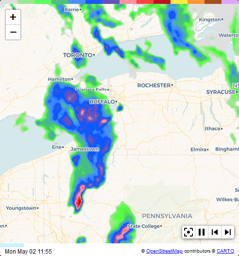

# Weather Radar Card

A Home Assistant rain radar card using tiled radar imagery from RainViewer, NOAA/NWS, and DWD (Deutscher Wetterdienst).

[](https://github.com/hacs/integration)
[![GitHub Release][releases-shield]][releases]
[![License][license-shield]](LICENSE)


## Description

This card displays animated weather radar loops within Home Assistant. It supports multiple radar data sources and map styles, and can be zoomed and panned seamlessly. Markers, hazard overlays (US wildfires + NWS watches & warnings), real-time lightning, a forecast nowcast (DWD), opt-in [motion-compensated playback](https://github.com/jpettitt/weather-radar-card/blob/main/docs/configuration.md#motion-compensation) (rain drifts between frames instead of teleporting), adjustable playback speed with optional per-user persistence, full sections-grid resize support, and 11 languages.



### Video demo

Full-screen capture with every feature enabled — radar with motion compensation, lightning, wind streamlines, hazard overlays, playback controls:

[](https://youtu.be/xfbZRElOi0o)

## What's new in 3.8 (current stable)

**Headline features:**

- **Themeable progress-bar colors** — `progress_bar_background_color`, `progress_bar_active_color`, and `progress_bar_now_color` override the timeline's built-in light/dark palette via YAML, to match your dashboard theme. ([3.8.0-beta1](https://github.com/jpettitt/weather-radar-card/releases/tag/v3.8.0-beta1))
- **Timestamps follow Home Assistant's own Time format setting** — the radar timeline and NWS alert times defer to your HA profile's 12h/24h preference (Settings → General) instead of guessing from the browser locale. ([3.8.0-beta1](https://github.com/jpettitt/weather-radar-card/releases/tag/v3.8.0-beta1))

**Also in 3.8 — fixes:**

- **Wildfire popup area and discovery date now follow your HA unit system and locale** — hectares for metric users instead of always showing NIFC's raw acres, and locale-aware date ordering. ([3.8.0-beta1](https://github.com/jpettitt/weather-radar-card/releases/tag/v3.8.0-beta1))
- **Forecast-heavy configs no longer load the farthest-future frame before "now"** — for a config like `past_minutes: 0, forecast_minutes: 60`, the initial load now always starts at "now" and fans outward, instead of loading highest-index-first. ([3.8.0-beta2](https://github.com/jpettitt/weather-radar-card/releases/tag/v3.8.0-beta2))
- **Fixed a periodic-refresh race that could corrupt playback position** — the timeline drifting backward on loop, or skip-back jumping to "Latest" instead of the previous frame. ([3.8.0-beta3](https://github.com/jpettitt/weather-radar-card/releases/tag/v3.8.0-beta3))

For the full release history see [CHANGELOG](https://github.com/jpettitt/weather-radar-card/blob/main/CHANGELOG.md).

## What's new in 3.7

- **Smooth motion** — opt-in `motion_compensation: true`. During each frame transition, rain slides along its actual direction of travel instead of crossfading in place, so the loop reads as one continuously drifting rain field. Pyramidal Lucas-Kanade optical flow, runs in a Web Worker, source-agnostic across DWD / RainViewer / NOAA. Built on top of [@genericJE](https://github.com/genericJE)'s [#156](https://github.com/jpettitt/weather-radar-card/pull/156). Pairs naturally with `smooth_animation`. ([3.7.0-alpha2](https://github.com/jpettitt/weather-radar-card/releases/tag/v3.7.0-alpha2))
- **Adjustable playback speed** — toolbar button cycles ¼× / ½× / 1× / 2× / 4×; editor dropdown sets the YAML default. Optional per-user persistence via the `viewer_layer_control` admin opt-in: each viewer's chosen speed follows them across browsers and devices. Contributed by [@genericJE](https://github.com/genericJE). ([3.7.0-alpha1](https://github.com/jpettitt/weather-radar-card/releases/tag/v3.7.0-alpha1))
- **Canvas rendering for lightning and hazard overlays** — strikes, NWS alert polygons, and wildfire perimeters paint to canvas instead of one DOM node per item. Identical visuals and clickability (strike clicks select the most recent within 10 px); soak-validated during live storms at 10,000 simultaneous strikes with the page fully responsive. ([3.7.0-beta1](https://github.com/jpettitt/weather-radar-card/releases/tag/v3.7.0-beta1))
- **Stability wave** — full-project code-review remediation: refresh/state races fixed (long-running dashboards no longer accumulate duplicate frames), DWD coverage clipping + single shared boundary mask, exponential backoff on alert/wildfire fetch failures, bounded caches, antimeridian fixes for Alaska. ([3.7.0-alpha3](https://github.com/jpettitt/weather-radar-card/releases/tag/v3.7.0-alpha3))
- **NOAA radar rebuilt on NCEP's opengeo GeoServer** (the backend radar.weather.gov itself runs on) — the newest frame is now **~2 minutes behind real time instead of 15–25**, every frame is a distinct radar scan, and a new **Frame interval** dropdown picks 2 / 5 / 10-minute loop density. ([3.7.0-beta2](https://github.com/jpettitt/weather-radar-card/releases/tag/v3.7.0-beta2))
- **"Latest" replaces "Now"** on the newest-frame label — radar frames lag real time by source (NOAA ~2 min, DWD ~5 min, RainViewer ~1–2 min), so the label no longer overstates freshness. ([3.7.0-beta2](https://github.com/jpettitt/weather-radar-card/releases/tag/v3.7.0-beta2))
- **Translations completed** for all 3.7 editor strings across the card's 11 languages.

## Roadmap

Active threads, no specific version commitment — with 3.8 shipped, these target 3.9 or later. See [docs/todo.md](https://github.com/jpettitt/weather-radar-card/blob/main/docs/todo.md) for the full backlog with status per item.

- **Real-time per-user layer visibility control panel** — UI for toggling individual overlays in real time. Persistence framework already shipped (3.6.5); first consumer shipped (playback speed in 3.7.0-alpha1); the on-map panel itself is the remaining piece. Full design in [docs/layer-control-design.md](https://github.com/jpettitt/weather-radar-card/blob/main/docs/layer-control-design.md).
- **Additional wind sources** — Open-Meteo for global coverage, ICON pressure levels for upper-air wind, regional finer-than-ICON-D2 sources (AROME, MEPS, HRRR). Tiers and trade-offs documented in [docs/todo.md](https://github.com/jpettitt/weather-radar-card/blob/main/docs/todo.md).

## Documentation

| Topic | What's there |
| --- | --- |
| [Configuration](https://github.com/jpettitt/weather-radar-card/blob/main/docs/configuration.md) | Full options table, Map Style choices, Animation knobs, Double-tap action, sections-grid behaviour |
| [Data Sources](https://github.com/jpettitt/weather-radar-card/blob/main/docs/data-sources.md) | RainViewer / NOAA / DWD specifics, per-source caps, NOAA & DWD notes, DWD forecast leading-edge note |
| [Hazard & Layer Overlays](https://github.com/jpettitt/weather-radar-card/blob/main/docs/overlays.md) | US wildfire perimeters, NWS watches & warnings, lightning (Blitzortung), and global wind — usage, knobs, **safety disclaimers** |
| [Markers](https://github.com/jpettitt/weather-radar-card/blob/main/docs/markers.md) | The `markers[]` schema, track-resolution rules, default home marker, migration from the legacy single-marker fields |
| [Examples](https://github.com/jpettitt/weather-radar-card/blob/main/docs/examples.md) | Sample YAMLs for common setups (basic, dense DWD loop, NOAA, OSM, mobile-only, person tracking, hazard overlays) |
| [Animation architecture](https://github.com/jpettitt/weather-radar-card/blob/main/docs/animation.md) | Internal: layer z-stack, two-slot crossfade, opacity ownership, dynamic tile size, pause behaviour, invariants |
| [Wildfire feature design](https://github.com/jpettitt/weather-radar-card/blob/main/docs/wildfire-feature-design.md) | Internal: NIFC WFIGS feed, render decisions, InciWeb gating, refresh cadence |
| [NWS alerts feature design](https://github.com/jpettitt/weather-radar-card/blob/main/docs/nws-alerts-feature-design.md) | Internal: api.weather.gov polling, zone resolution + caching, severity sort, popup chrome |
| [Wind feature design](https://github.com/jpettitt/weather-radar-card/blob/main/docs/wind-feature-design.md) | Internal: bulk WCS fetch + adaptive scaling, coalescing cache, zoom-aware streamlines, layering |
| [Motion compensation feature design](https://github.com/jpettitt/weather-radar-card/blob/main/docs/motion-compensation-feature-design.md) | Internal: pyramidal Lucas-Kanade optical flow, distance-from-white channel, inline-Blob worker pattern, crossfade-time translate |
| [Backlog / TODO](https://github.com/jpettitt/weather-radar-card/blob/main/docs/todo.md) | Open and shipped features |
| [Contributing](https://github.com/jpettitt/weather-radar-card/blob/main/CONTRIBUTING.md) | Local dev setup including the Docker HA testbed (`npm run ha:up`) |

## Install

### HACS

The card is part of the default HACS store. To install the latest stable, search for "Weather Radar Card" in HACS → Frontend → Explore & Add Repositories. Toggle **Show beta versions** in HACS to opt into prereleases.

### Manual

Download the files from the [latest release](https://github.com/jpettitt/weather-radar-card/releases) and place them in `www/community/weather-radar-card` in your HA `config` directory:

```text
└── configuration.yaml
└── www
    └── community
        └── weather-radar-card
            └── weather-radar-card.js
            └── home-circle-dark.svg
            └── home-circle-light.svg
            └── pause.png
            └── play.png
            └── preview.jpg
            └── radar-colour-bar-dwd.png
            └── radar-colour-bar-nws.png
            └── radar-colour-bar-universalblue.png
            └── recenter.png
            └── skip-back.png
            └── skip-next.png
```

> **Upgrading from v2?** Delete `leaflet.js`, `leaflet.css`, `leaflet.toolbar.min.js`, and `leaflet.toolbar.min.css` from `www/community/weather-radar-card/` — they are bundled into `weather-radar-card.js` in v3 and the old files are no longer used.

Then add the following to your Lovelace resources:

```yaml
resources:
  - url: /local/community/weather-radar-card/weather-radar-card.js
    type: module
```

## Minimal config

```yaml
type: 'custom:weather-radar-card'
```

That's it. The card defaults to RainViewer, your HA instance's location, and a `zone.home` marker. From there, the GUI editor exposes every knob — see [Configuration](https://github.com/jpettitt/weather-radar-card/blob/main/docs/configuration.md) for the full reference and [Examples](https://github.com/jpettitt/weather-radar-card/blob/main/docs/examples.md) for common starting points.

For touchscreen dashboards, YAML can enlarge the timeline scrub target upward over the lower map while preserving its slim visual track and original bottom-bar height:

```yaml
show_progress_bar: true
progress_bar_touch_height: 44
```

## Sizing

How tall the card renders depends on where it lives:

- **Masonry / panel views, or a sections cell with `rows: auto`** — the card uses the `height:` config option (default `400px`). This is the normal case.
- **A sections-grid cell with a fixed row count** (you've dragged the resize handle, or `rows:` is a number) — **the grid cell owns the height.** The card fills the cell and the `height:` option is ignored; resize it with the cell's drag handle instead. The editor disables the height box in this case so it's clear which control is in charge.

In other words: `rows: auto` → `height:` applies; `rows: <number>` → the cell's height applies. See [sections-grid behaviour](https://github.com/jpettitt/weather-radar-card/blob/main/docs/configuration.md#sections-grid-support) for details.

## Changelog

See [CHANGELOG.md](https://github.com/jpettitt/weather-radar-card/blob/main/CHANGELOG.md) for the complete history of changes.

[license-shield]: https://img.shields.io/github/license/jpettitt/weather-radar-card.svg?style=for-the-badge
[releases-shield]: https://img.shields.io/github/release/jpettitt/weather-radar-card.svg?style=for-the-badge
[releases]: https://github.com/jpettitt/weather-radar-card/releases
